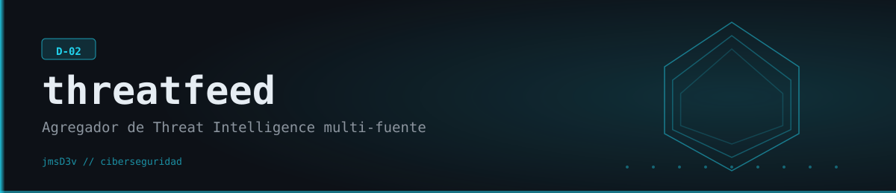

# ThreatFeed



Agregador de inteligencia de amenazas (D-02) que consulta varias fuentes CTI en paralelo para un mismo IOC (IP, dominio, URL o hash), fusiona los resultados y usa IA (Claude, Gemini u OpenAI, la que tengas configurada) para escribir el análisis en lenguaje natural.

## Qué hace

ThreatFeed toma uno o más IOCs (o los lee de un archivo) y los consulta simultáneamente contra ThreatFox (abuse.ch), Shodan InternetDB, y — si hay API key configurada — AbuseIPDB, VirusTotal y AlienVault OTX. Los resultados de todas las fuentes que respondieron se fusionan en un único registro por IOC (severidad más alta gana, se unen fuentes/tags/familias de malware), y opcionalmente la IA genera un resumen de contexto de amenaza + 3 recomendaciones defensivas por IOC, más un resumen ejecutivo del scan completo. ThreatFox y Shodan InternetDB no requieren API key y ya dan cobertura real; los otros tres feeds se activan automáticamente en cuanto detectan su variable de entorno seteada. Sin ninguna API key de IA configurada, el enriquecimiento se omite (sin narrativa, sin error) — el resto de la herramienta funciona igual.

## Características

- **5 fuentes CTI**: ThreatFox, Shodan InternetDB (ambas gratis, sin key), AbuseIPDB, VirusTotal, AlienVault OTX (requieren key, se activan solas si está presente).
- **Consultas en paralelo** con `httpx.AsyncClient` + `asyncio.gather`, con semáforo para no saturar los feeds.
- **Fusión de resultados**: un IOC visto por varias fuentes se combina en un solo registro (severidad máxima, unión de tags/categorías/familias de malware, primer dato no nulo por campo).
- **Auto-detección de tipo de IOC** (IP, dominio, URL, hash MD5/SHA1/SHA256, CVE) por regex, o se puede forzar con `--type`.
- **Enriquecimiento con IA, sin atarse a un proveedor**: soporta Anthropic Claude, Google Gemini y OpenAI — usa automáticamente el que tenga API key configurada. Contexto de amenaza + recomendaciones por IOC, y resumen ejecutivo del scan completo (familias de malware más vistas, nivel de amenaza general, acción inmediata recomendada).
- **Feed `recent`**: trae los IOCs más recientes publicados en ThreatFox (JSON export público, sin key) para threat hunting proactivo.
- **Reportes HTML** (Jinja2) y **PDF opcional** (WeasyPrint, si está instalado — si no, cae de nuevo a HTML sin romper).
- **Entrada por archivo**: `threatfeed file iocs.txt` para procesar listas completas (ignora líneas vacías y comentarios `#`).

## Requisitos

- Python **3.11+** (probado en este repo con 3.14.6 sobre Windows).
- Para el enriquecimiento con IA (resúmenes y recomendaciones) — configurá **cualquiera de estas API keys**: `ANTHROPIC_API_KEY`, `GEMINI_API_KEY` u `OPENAI_API_KEY`. Sin ninguna, todo el resto funciona igual. Si configurás más de una, la prioridad es: **Anthropic > Gemini > OpenAI**.
- Opcionales, cada uno habilita un feed adicional automáticamente si está seteado:
  - `ABUSEIPDB_API_KEY`
  - `VIRUSTOTAL_API_KEY`
  - `OTX_API_KEY`
- `SHODAN_API_KEY` aparece en `.env.example` pero **no se usa**: el feed de Shodan implementado es InternetDB (`internetdb.shodan.io`), que es gratuito y no pide key.

## Instalación

```bash
cd threatfeed
python -m venv .venv
source .venv/Scripts/activate      # Windows: .venv\Scripts\activate
pip install -e .

cp .env.example .env
# editar .env: UNA de ANTHROPIC_API_KEY/GEMINI_API_KEY/OPENAI_API_KEY (IA) y las keys opcionales que tengas
```

Instalación verificada localmente: `pip install -e .` resuelve sin conflictos (httpx, aiohttp, typer, rich, jinja2, pydantic, google-generativeai, anthropic, openai, etc.).

## Uso

```bash
# Ver qué feeds están activos según las keys en .env
threatfeed feeds

# Consultar uno o más IOCs (usa ThreatFox + Shodan sin key; suma AbuseIPDB/VT/OTX si hay key)
threatfeed lookup 8.8.8.8 evil-domain.example

# Forzar el tipo si el auto-detect no alcanza
threatfeed lookup d41d8cd98f00b204e9800998ecf8427e --type file_hash

# Consultar sin IA (más rápido, no necesita ninguna API key de IA)
threatfeed lookup 185.220.101.42 --no-ai

# Enriquecer una lista de IOCs desde un archivo y guardar reporte HTML
threatfeed file iocs.txt --output reporte.html

# IOCs recién publicados en ThreatFox (threat hunting, sin key)
threatfeed recent --days 1 --limit 100 --min-severity high

# Guardar salida como JSON en vez de HTML
threatfeed lookup 8.8.8.8 --output resultado.json --format json
```

Probado en este repo contra la red real: `threatfeed lookup 8.8.8.8 --no-ai` y `threatfeed recent --days 1 --limit 5` devuelven resultados reales de ThreatFox/Shodan InternetDB sin ninguna API key configurada.

## Estructura del proyecto

```
threatfeed/
├── pyproject.toml
├── .env.example
└── threatfeed/
    ├── types/ioc.py            # IOC, ThreatReport, Severity, ThreatCategory
    ├── feeds/
    │   ├── base.py              # BaseFeed (httpx.AsyncClient como context manager)
    │   ├── threatfox.py         # abuse.ch — gratis, sin key
    │   ├── shodan.py             # Shodan InternetDB — gratis, sin key
    │   ├── abuseipdb.py          # requiere ABUSEIPDB_API_KEY
    │   ├── virustotal.py         # requiere VIRUSTOTAL_API_KEY
    │   └── otx.py                # requiere OTX_API_KEY
    ├── core/aggregator.py       # dispatch en paralelo + fusión de resultados
    ├── analyzers/ai_enricher.py # llamadas a Claude/Gemini/OpenAI, auto-detección por API key
    ├── report/
    │   ├── generator.py         # HTML (Jinja2) + PDF (WeasyPrint opcional)
    │   └── template.html
    └── cli/main.py              # comandos: lookup, file, recent, feeds
```

## Aviso legal

Proyecto educativo / de portfolio. Las consultas contra feeds públicos (ThreatFox, Shodan InternetDB) usan IOCs de ejemplo o propios — no se recomienda usar esta herramienta para justificar acciones automáticas de bloqueo sin revisión humana. Respetá los límites de rate y los términos de uso de cada API (especialmente AbuseIPDB y VirusTotal en su tier gratuito).

<div align="center">

Copyright © [@jmsDev](https://www.linkedin.com/in/jmsilva83) — Desarrollado desde Las Breñas con 💜 · All rights reserved

</div>
